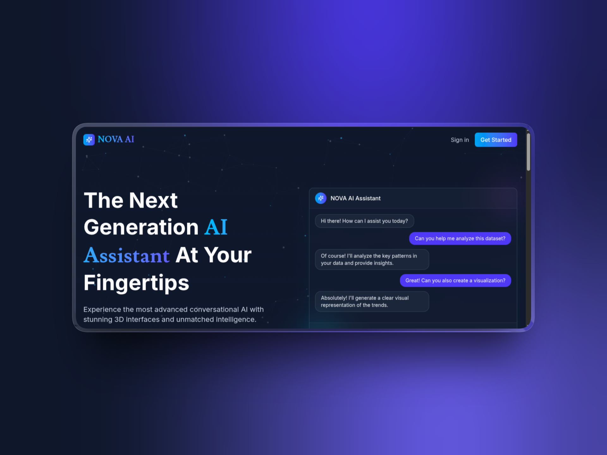

# AI Chatbot with RAG

Chat with your own documents. Upload a PDF, DOCX, or text file, ask questions in natural language, and get answers grounded in the source — with citations that point back to the exact file and page.

Built to explore one idea properly: **retrieval is a UX problem, not just a retrieval problem.** An AI that answers from your documents is only useful if you can trust the answer, so this project puts citations, confidence thresholds, and honest "I don't know" responses at the center rather than treating them as afterthoughts.

<!-- Replace with a real screenshot or GIF of the chat + citations in action -->


**Live demo:** https://ai-chatbot-lyart-alpha.vercel.app/

---

## What it does

- **Upload documents** — PDF, DOCX, TXT, and Markdown, up to 10 MB, with drag-and-drop.
- **Ask in plain language** — the assistant answers from your uploaded documents, not from general knowledge.
- **Verifiable citations** — every grounded answer cites its sources as `[1]`, `[2]`, each linking to a filename and page number.
- **Honest about gaps** — when your documents don't contain the answer, it says so instead of guessing.
- **Streaming responses** — answers render token by token, with citations appearing as soon as retrieval completes.
- **Per-user isolation** — documents and chat history are scoped to the signed-in user.

## How the RAG pipeline works

```
Upload → parse (per page) → chunk → embed → store in pgvector
                                                    │
Question → embed → vector search → threshold filter → prompt with context → stream answer + citations
```

1. **Ingestion** — uploaded files are parsed with page boundaries preserved, split into ~1000-character chunks with 200 characters of overlap (so a sentence spanning a boundary stays retrievable), embedded with Gemini `text-embedding-001`, and stored as 768-dimension vectors in Postgres via **pgvector**.
2. **Retrieval** — the question is embedded and matched against the user's chunks by cosine similarity, using an **HNSW index** for speed.
3. **Relevance thresholding** — chunks below a similarity floor are discarded. If nothing clears the bar, the request falls through to a normal chat rather than forcing an answer out of irrelevant context. This is the single most important guardrail against confident hallucination.
4. **Generation** — surviving chunks go into the system prompt, numbered and labeled with filename and page. The model is instructed to cite what it uses and to flag anything the context doesn't support.
5. **Citations** stream to the client ahead of the answer text, so the UI can render them immediately.

## Tech stack

| Layer | Choice |
|---|---|
| Framework | Next.js 15 (App Router), React 19 |
| Language | TypeScript |
| AI orchestration | LangChain.js |
| Models | Google Gemini (chat + `text-embedding-001`) |
| Vector store | Postgres + pgvector (HNSW index) |
| ORM | Prisma |
| Auth | NextAuth v5 |
| Streaming | Server-Sent Events |
| UI | Tailwind CSS, shadcn/ui |

## Running locally

**Prerequisites:** Node.js 18+, a Postgres database with the `pgvector` extension available, and a Google Generative AI API key.

```bash
# 1. Install
npm install

# 2. Configure environment
cp .env.example .env
# then set DATABASE_URL and GOOGLE_GENERATIVE_AI_API_KEY

# 3. Enable pgvector and apply the schema
npx prisma db execute --file ./enable-vector.sql --schema ./prisma/schema.prisma
npx prisma db push
npx prisma db execute --file ./hnsw.sql --schema ./prisma/schema.prisma
npx prisma generate

# 4. Run
npm run dev
```

Open [http://localhost:3000](http://localhost:3000), sign in, upload a document, and start asking.

### Environment variables

```
DATABASE_URL=                     # Postgres connection string (pgvector-enabled)
GOOGLE_GENERATIVE_AI_API_KEY=     # used for both chat and embeddings
AUTH_SECRET=                      # NextAuth secret
# plus any OAuth provider credentials you configure
```

## Design decisions worth calling out

- **Why a similarity floor?** Without one, an unrelated question still returns the least-irrelevant chunks and the model answers from them. The floor makes "I don't know" reachable — the difference between a demo and something trustworthy.
- **Why chunk per page?** So every chunk carries its page number and citations can say "page 12," not just name a file. Verifiability costs almost nothing here and matters a lot.
- **Why pgvector instead of a dedicated vector DB?** One database, one backup story, and chunks cascade-delete with their parent document for free. No second service to run or pay for.
- **Why raw SQL for vectors?** Prisma has no native `vector` type, so vector reads and writes go through parameterized `$queryRaw` / `$executeRaw`, while everything else stays on the typed client.

## Roadmap

- [ ] Background ingestion queue for large files (schema already tracks a `processing` status)
- [ ] OCR fallback for scanned PDFs
- [ ] Cross-encoder reranking over the top-K results for higher precision
- [ ] Multi-document scoping (ask across a chosen subset)

## License

MIT
